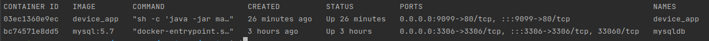
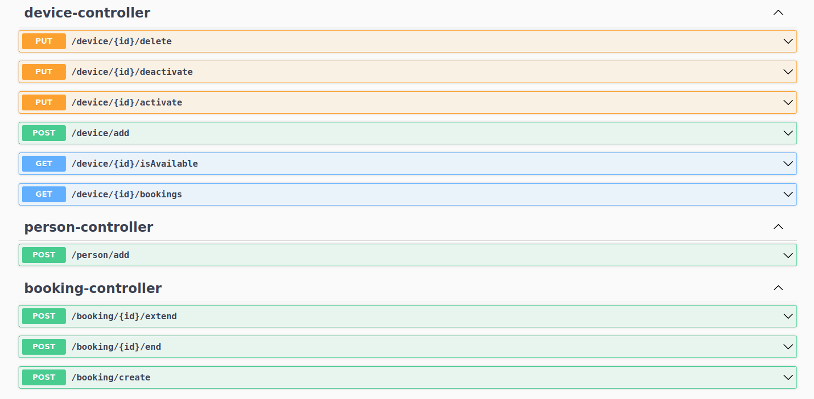
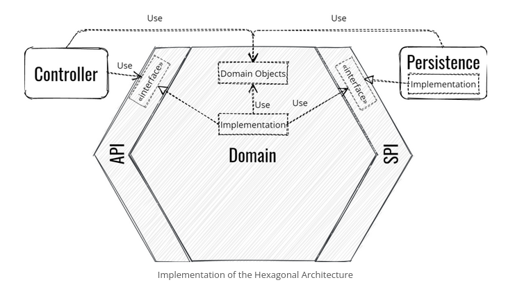
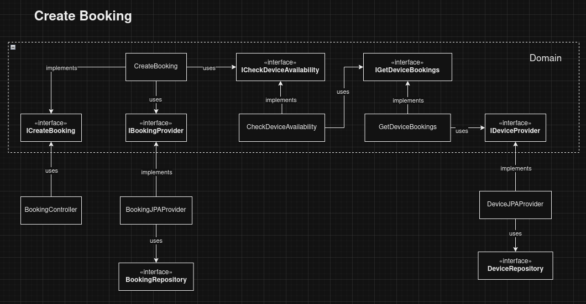
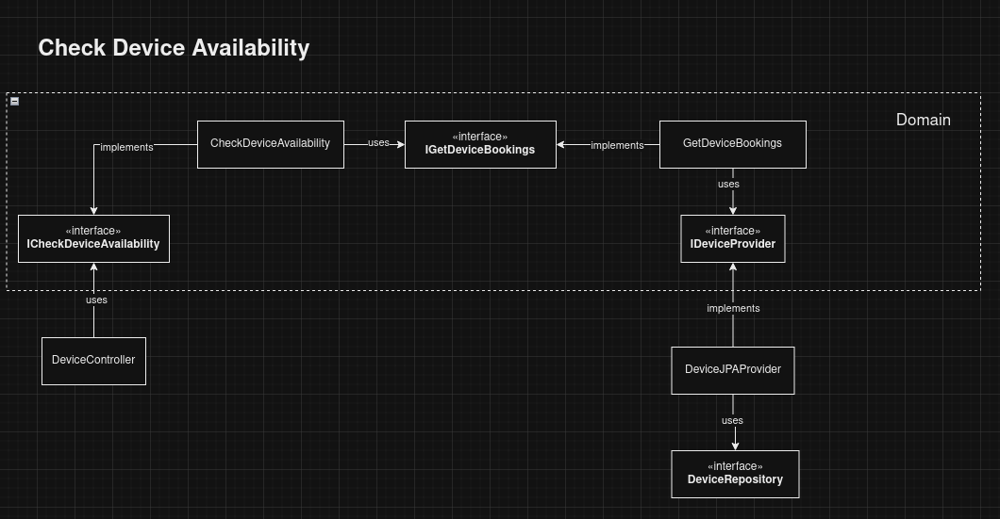
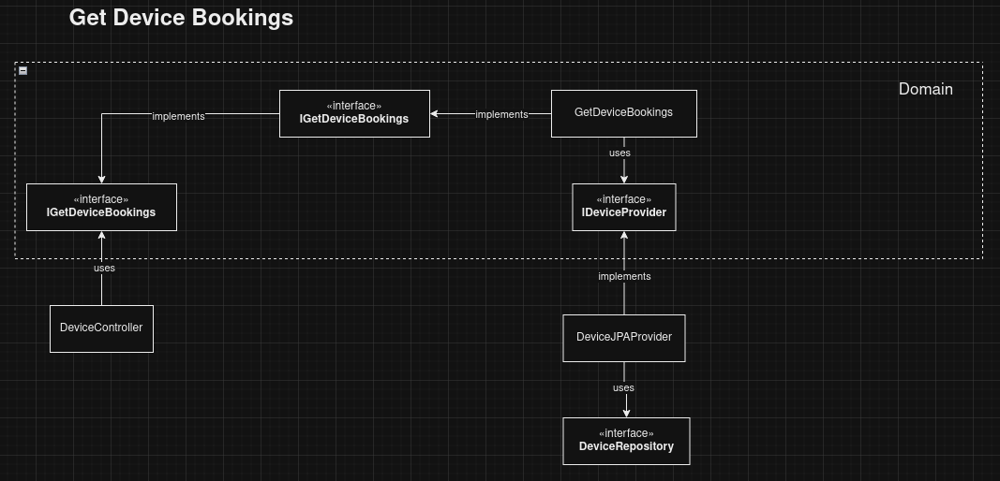

# Device Inventory System

---

#### The goal of the application is to create a device booking system. The registered devices can be booked by registered persons from the IT department.

## Booking Rules
1. A person can book the device only if device is not booked by another person
2. A person can book the device indefinitely (from current time until device is returned)
3. A person can book the device until an end date (from current time until specified end date)
4. A person that book the device within a duration can extend the booking
5. A person can return the device earlier than the specified end date thus ending the booking
6. A person can do future booking by specifying future duration

## Device Rules
1. A new device can be registered to be added in the inventory
2. A device can be activated/deactivated
3. A device can be soft deleted
4. A device can be checked for availability

***

## Running the Application

1. Clone the github repository: 
2. Run `sudo docker-compose up`

3. Access swagger and test the apis using this link http://localhost:9099/swagger-ui/index.html#/

***

## Specifications
* Java 17
* Spring Boot 3.1.2
* MySQL 5.7

## Architecture

The project follows hexagonal architecture. The domain contains the business logic which is completely isolated from the infrastructure. The controller accesses the domain through the application programming interfaces (APIs) while the resources needed by the domain is being injected by the providers by implementing the service provider interfaces (SPIs). 

## UML

***

## Moving forward
* More unit and integration tests
* Exception and error handling
* Identity management (authentication and authorization)
* Its good practice to have metrics, tracing and logging for observability
* Instead of docker, databases are advised to be hosted in a fully managed database-as-a-service solutions like AWS RDS
* Error monitoring like sentry would help in issue discovery and resolution

